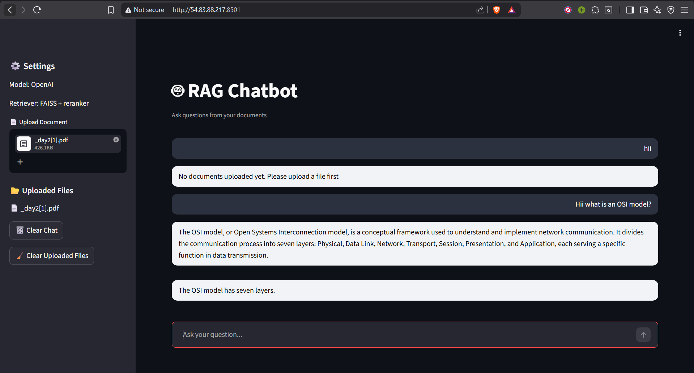
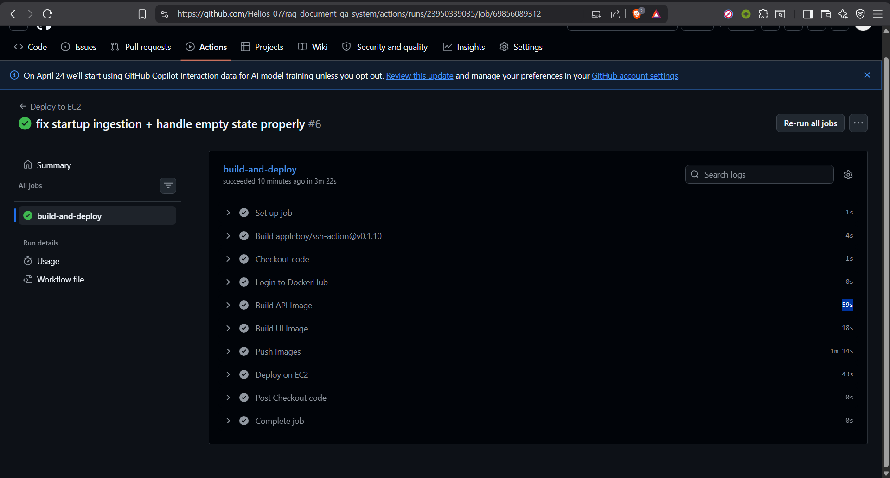
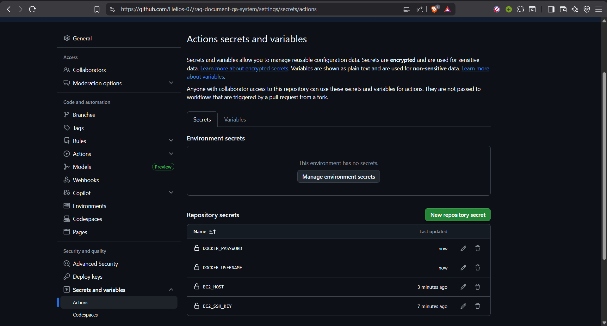
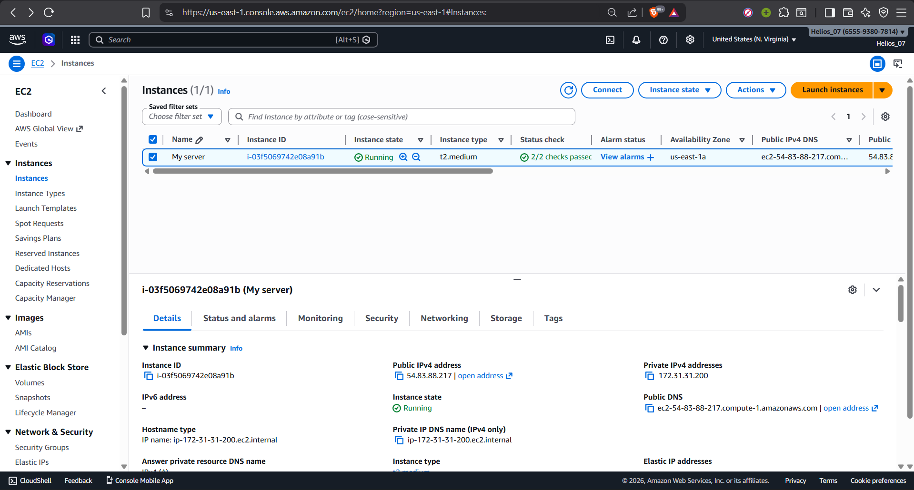

# RAG Document Q&A System


##  Overview

**RAG Document Q&A System** is an intelligent document retrieval and question-answering application built with modern machine learning techniques. It leverages **Retrieval-Augmented Generation (RAG)** to combine semantic search, intelligent reranking, and large language models to provide accurate, context-aware answers from your document corpus.

The system processes documents, creates semantic embeddings, stores them in a FAISS vector index, and uses a state-of-the-art LLM to generate comprehensive answers grounded in retrieved context.

---

##  Features

- ** Multi-Format Document Support**
  - Ingest PDF, plain text.
  - Automatic document chunking with configurable overlap
  
- ** Semantic Search**
  - FAISS vector store for fast, scalable similarity search
  - Sentence Transformer embeddings (BAAI/bge-base-en) for semantic understanding
  
- ** Intelligent Reranking**
  - Cross-encoder reranking (ms-marco-MiniLM-L-6-v2) for improved retrieval quality
  - Top-k retrieval with configurable thresholds

- ** LLM-Powered Response Generation**
  - OpenAI GPT-4o-mini for natural, coherent response generation
  - Temperature control for response variability
  - Context-aware answers grounded in retrieved documents

- ** Dual Interface**
  - **REST API**: FastAPI with interactive Swagger documentation
  - **Web UI**: Streamlit interface for intuitive document upload and querying

- ** Stateless & Robust Architecture**
  - Dynamic user-driven uploading; no local dependencies (such as `data/raw/` or `artifacts/`) required at startup
  - Automatic, real-time index creation and dynamic retriever refreshes upon successful ingestion
  - Crash-proof stateless design suited for modern Docker environments

- ** Containerized Deployment**
  - Docker & Docker Compose for easy multi-service deployment
  - Pre-configured API and UI containers

- ** Production-Ready Logging**
  - Comprehensive logging with custom exception handling

---

##  Tech Stack

| Component | Technology | Purpose |
|-----------|-----------|---------|
| **Backend** | FastAPI | REST API for RAG operations |
| **Frontend** | Streamlit | Interactive web interface |
| **Embeddings** | Sentence Transformers | Convert text to semantic vectors |
| **Vector Store** | FAISS | Fast similarity search at scale |
| **LLM** | OpenAI GPT-4o-mini | Response generation |
| **Reranking** | Cross-Encoder | Improve retrieval relevance |
| **Infrastructure** | Docker | Containerization & orchestration |
| **Deep Learning** | PyTorch, Transformers | ML model backbone |

---

##  Screenshots

### RAG Chatbot Dashboard

*Main Q&A interface with document upload and chat capabilities*

### GitHub Actions Deployment

*Automated CI/CD pipeline for building and pushing Docker images*

### GitHub Actions Secrets

*Secure configuration for DockerHub and EC2 deployments*

### AWS EC2 Deployment

*Running the containerized RAG system on an AWS EC2 instance*

---

##  Installation

### Prerequisites
- **Python** 3.12 or higher
- **Docker** & **Docker Compose** (for containerized deployment)
- **OpenAI API Key** (for LLM access)
- **4GB+ RAM** (minimum for FAISS indexing)

### Step 1: Clone the Repository
```bash
git clone https://github.com/Helios-07/rag-document-qa-system.git
cd rag-document-qa-system
```

### Step 2: Create a Virtual Environment
```bash
# Create virtual environment
python -m venv venv

# Activate virtual environment
# On Windows:
venv\Scripts\activate
# On macOS/Linux:
source venv/bin/activate
```

### Step 3: Install Dependencies

Using standard `pip`:
```bash
pip install -r requirements_api.txt
pip install -r requirements_ui.txt
```

Using `uv` (Recommended if you have `uv` installed):
```bash
uv sync  # highly recommended for fast dependency resolution
```

Alternatively, install via `pyproject.toml`:
```bash
pip install -e .
```

### Step 4: Configure Environment Variables
Create a `.env` file in the project root:
```env
OPENAI_API_KEY=your_openai_api_key_here
AWS_ACCESS_KEY_ID=your_aws_access_key
AWS_SECRET_ACCESS_KEY=your_aws_secret_key
AWS_REGION=us-east-1
LOG_LEVEL=INFO
```

### Step 5: Configure Application Settings
Edit `config.yaml` to customize:
```yaml
chunking:
  chunk_size: 150      # Size of text chunks
  overlap: 30          # Overlap between chunks

embedding:
  model_name: BAAI/bge-base-en  # Embedding model

generation:
  model_name: gpt-4o-mini       # LLM model
  temperature: 0.2              # Response creativity (0-1)

retrieval:
  top_k: 5             # Number of docs to retrieve
  reranker_model: cross-encoder/ms-marco-MiniLM-L-6-v2
```

---

##  Usage

### Option 1: Command-Line Interface

Run the CLI application for interactive document Q&A:

```bash
python main.py
```

**Example interaction:**
```
Starting RAG Application

Enter your question (or type 'exit'): What are the main topics covered in the documents?

[System processes query, retrieves relevant documents, generates response]

Enter your question (or type 'exit'): exit
Exiting...
```

### Option 2: REST API

Start the FastAPI server:

```bash
uvicorn app.api:app --host 0.0.0.0 --port 8000 --reload
```

**Access the API:**
- Interactive Docs: `http://localhost:8000/docs`
- ReDoc: `http://localhost:8000/redoc`

**Example API Request:**
```bash
curl -X POST "http://localhost:8000/query" \
  -H "Content-Type: application/json" \
  -d '{
    "question": "What are the key findings?",
    "top_k": 5
  }'
```

### Option 3: Web UI (Streamlit)

Start the Streamlit interface:

```bash
streamlit run app/ui.py
```

The application will open at `http://localhost:8501`

**Features:**
- Upload documents in the sidebar
- View settings (Model: OpenAI, Retriever: FAISS + Reranker)
- Interactive chat interface
- Document management

### Option 4: Docker Compose (Recommended for Production)

Run both API and UI together:

```bash
docker-compose up -d
```

This starts:
- **API**: `http://localhost:8000`
- **UI**: `http://localhost:8501`

To stop services:
```bash
docker-compose down
```

---

##  Project Structure

```
rag-project/
├── app/
│   ├── api.py                 # FastAPI endpoints
│   └── ui.py                  # Streamlit web interface
├── src/
│   ├── embedding/
│   │   └── embedding.py       # Text embedding generation
│   ├── generation/
│   │   └── generation.py      # LLM response generation
│   ├── ingestion/
│   │   ├── chunker.py         # Document chunking logic
│   │   └── loader.py          # Document loading
│   ├── pipeline/
│   │   ├── ingest.py          # Ingestion pipeline
│   │   └── rag_pipeline.py    # Main RAG orchestration
│   ├── retrieval/
│   │   └── retriever.py       # FAISS search & reranking
│   ├── utils/
│   │   ├── exception.py       # Custom exceptions
│   │   └── logger.py          # Logging configuration
│   └── vector_store/
│       └── faiss_store.py     # FAISS index management
├── artifacts/
│   └── faiss_index/           # FAISS index storage
├── data/
│   └── raw/                   # Input documents
├── logs/                      # Application logs
├── docker/
│   ├── Dockerfile.api         # API container definition
│   └── Dockerfile.ui          # UI container definition
├── config.yaml                # Application configuration
├── docker-compose.yml         # Multi-container setup
├── main.py                    # CLI entry point
├── pyproject.toml             # Project metadata
├── requirements_api.txt       # Python dependencies
└── README.md                  # This file
```

---

##  Configuration

### `config.yaml` - Main Configuration

| Parameter | Default | Description |
|-----------|---------|-------------|
| `chunking.chunk_size` | 150 | Characters per document chunk |
| `chunking.overlap` | 30 | Overlap between chunks in characters |
| `data.input_path` | data/raw/ | Target location for raw input documents |
| `embedding.model_name` | BAAI/bge-base-en | HuggingFace embedding model |
| `generation.model_name` | gpt-4o-mini | OpenAI model for generation |
| `generation.temperature` | 0.2 | Response diversity (0=deterministic, 1=creative) |
| `retrieval.top_k` | 5 | Number of documents to retrieve |
| `retrieval.reranker_model` | cross-encoder/ms-marco-MiniLM-L-6-v2 | Reranker model |
| `paths.faiss_index` | artifacts/faiss_index/index.faiss | Path to FAISS index |
| `paths.chunks` | artifacts/chunks.pkl | Path to store cached chunk arrays |

### Environment Variables

```env
# OpenAI Configuration
OPENAI_API_KEY=sk-...

# AWS Configuration (optional, for S3 storage)
AWS_ACCESS_KEY_ID=...
AWS_SECRET_ACCESS_KEY=...
AWS_REGION=us-east-1

# UI Configuration (Optional)
API_URL=http://localhost:8000 # Point Streamlit UI to a specific backend url

# Logging
LOG_LEVEL=INFO  # DEBUG, INFO, WARNING, ERROR
```

---

##  How It Works

### RAG Pipeline Overview

1. **Dynamic Document Ingestion**
   - User uploads a document directly via the UI or API `/upload` endpoint
   - Document is processed dynamically (stateless, with no reliance on an established `data/raw/` directory)
   - Split into semantic chunks (configurable size & overlap)

2. **Embedding & Retriever Refresh**
   - Convert chunks to dense vectors using Sentence Transformers
   - Store vectors in FAISS index for fast retrieval
   - **Dynamic Retriever Reinitialization:** The retriever is aggressively refreshed (`pipeline.retriever = Retriever()`) to immediately surface newly ingested chunks without requiring an app restart

3. **Query Processing**
   - Embed user query using the same embedding model
   - Retrieve top-k similar documents from FAISS

4. **Intelligent Reranking**
   - Cross-encoder scores retrieved documents
   - Re-rank by relevance for improved accuracy

5. **Response Generation**
   - Pass reranked documents to OpenAI GPT-4o-mini
   - Generate context-aware, grounded response

6. **Result Delivery**
   - Return response via CLI, API, or Web UI
   - Include source documents and confidence metrics

---

##  Performance Considerations

- **Embedding Model**: BAAI/bge-base-en (~330M parameters, ~1.2GB memory)
- **Vector Dimension**: 768-dimensional embeddings
- **Query Latency**: ~100-500ms (depending on index size and hardware)
- **Index Size**: Scales linearly with number of documents
- **Memory**: ~1GB per 100K documents indexed

### Optimization Tips

1. Adjust `top_k` in `config.yaml` for latency vs. accuracy trade-off
2. Enable GPU support for faster embedding generation
3. Use production-grade FAISS indices (IVF_FLAT) for large corpora
4. Implement caching for frequent queries

---

##  Troubleshooting

### Issue: CUDA/GPU Not Available
```bash
# Use CPU-only FAISS
pip install faiss-cpu
```

### Issue: OpenAI API Errors
```bash
# Verify API key
echo $OPENAI_API_KEY

# Check API quota and billing at https://platform.openai.com/account/usage
```

### Issue: Import Errors
```bash
# Reinstall dependencies
pip install --no-cache-dir -r requirements_api.txt
```

### Issue: FAISS Index Corruption
```bash
# Clear corrupted index and cached chunks
rm -rf artifacts/faiss_index/
rm -f artifacts/chunks.pkl

# Then, simply upload a document via the UI or API to automatically generate a fresh index dynamically.
```

---

##  Logging

Logs are stored in the `logs/` directory with timestamps and severity levels:

```bash
# View recent logs
tail -f logs/rag_pipeline.log

# Filter by severity
grep ERROR logs/rag_pipeline.log
```

---

##  Contributing

Contributions are welcome! Please follow these steps:

1. Fork the repository
2. Create a feature branch (`git checkout -b feature/amazing-feature`)
3. Commit your changes (`git commit -m 'Add amazing feature'`)
4. Push to the branch (`git push origin feature/amazing-feature`)
5. Open a Pull Request

---

##  License

This project is licensed under the **MIT License** - see the [LICENSE](LICENSE) file for details.

---

##  Author

**Project Owner**: Aman Nautiyal
- GitHub: [@Helios-07](https://github.com/Helios-07)
- Email: amannautiyal794@gmail.com

---

##  Acknowledgments

- [OpenAI](https://openai.com/) for GPT models
- [BAAI](https://www.baai.ac.cn/) for BGE embeddings
- [Meta](https://www.meta.com/) for FAISS
- [HuggingFace](https://huggingface.co/) for transformers and cross-encoders

---


**Last Updated**: April 2026
**Version**: 0.1.0